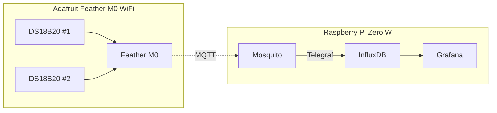

# Temperature Publisher

This code publishes the temperature values from N temperature sensors to an MQTT broker every second, using Wi-Fi.  It is used as part of a project to record the temperature of my steam radiator and my living room, over time.

## My specific setup  

An [Adafruit Feather M0 WiFi](https://www.adafruit.com/product/3044) with (2) [DS18B20 digital temperature sensors](https://www.adafruit.com/product/374) to record the temperatures and publishes them using MQTT via Wi-Fi.  On a [Raspberry Pi Zero W](https://www.raspberrypi.com/products/raspberry-pi-zero-w/), MQTT broker [Mosquito](https://mosquitto.org/) receives the messages and then [Telegraf](https://www.influxdata.com/time-series-platform/telegraf/) sends the data to an [InfluxDB database](https://www.influxdata.com/products/influxdb/).  [Grafana](https://grafana.com/oss/grafana/) reads from the database and generates a time history chart of the temperatures.

